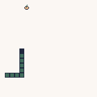

# WASM-4 Tutorial Snake game written in Zig



## Prerequisites

* [The Zig language](https://ziglang.org/) - needs a recent build with [this change](https://github.com/ziglang/zig/commit/e89e3735f3faead04e7b2e443a1795213c927ec8)
* [WASM-4: Build retro games using WebAssembly for a fantasy console](https://wasm4.org/)

## Build and run

```sh
zig build
w4 run zig-out/lib/main.wasm
```
